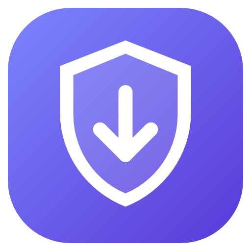
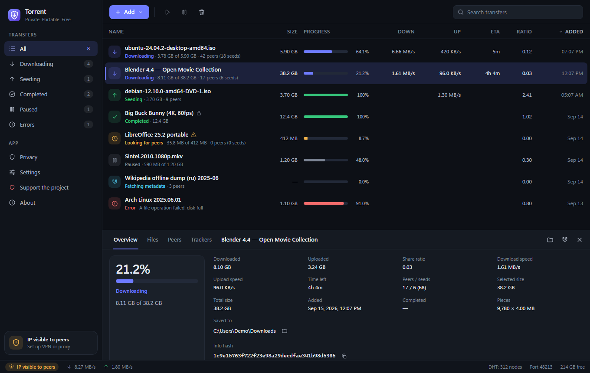
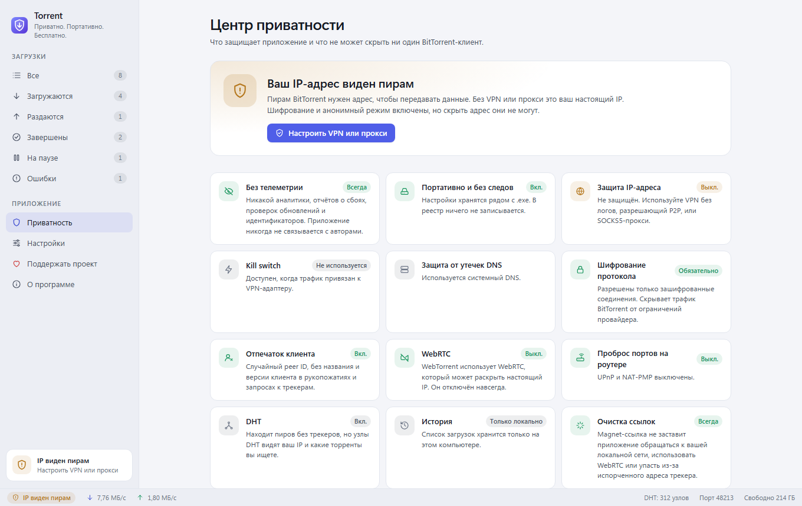
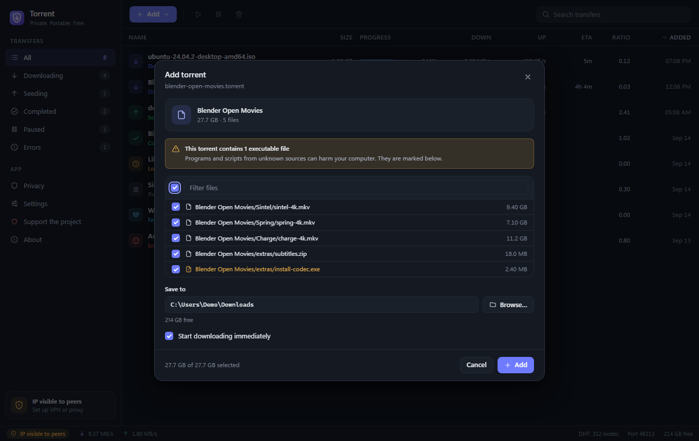

<p align="center">
  
</p>

<h1 align="center">Torrent</h1>
<p align="center"><b>Private. Portable. Free.</b><br>
A BitTorrent client that collects nothing, installs nothing and is honest about what it can protect.</p>

<p align="center">
  <a href="README.ru.md">Русская версия</a> ·
  <a href="PRIVACY.md">Privacy policy</a> ·
  <a href="SECURITY.md">Security model</a>
</p>

<p align="center">
  <a href="https://github.com/ClearNetSky/Torrent/actions/workflows/ci.yml"></a>
</p>



## Why

Most torrent clients ship with ads, bundled offers, update pings, crash reporters or analytics, and many announce exactly who you are to everyone in the swarm. This one is a single `Torrent.exe` you can run from any folder or USB stick:

- **No telemetry, ever.** No analytics, crash reports, update checks, accounts or identifiers. The app never contacts its authors.
- **Portable and traceless.** Settings and resume data live in `TorrentData\` next to the executable. Nothing touches the registry. Delete the folder and it is gone.
- **Honest privacy.** A live Privacy center shows what is protected and clearly says what no BitTorrent client can hide.

## Features

**Privacy and network protection**

| | |
|---|---|
| VPN binding + kill switch | Every socket (peers, trackers, DHT, web seeds, DNS) is bound to your VPN adapter. If the VPN drops, all transfers stop instantly and nothing can leave through your regular connection. They resume when it reconnects. |
| SOCKS5 proxy | Peer and tracker traffic goes through the proxy. Host names are resolved by the proxy, local DNS lookups are blocked, and DHT, UDP trackers, uTP and incoming connections are disabled so nothing bypasses it. |
| Anonymous mode | Random 20-byte peer ID; no client name or version in handshakes or tracker requests (not even an HTTP User-Agent). |
| Protocol encryption | Required by default. After the obfuscated handshake the full stream is RC4-encrypted, so ISP traffic shaping cannot recognise it. |
| WebRTC disabled | WebTorrent/WebRTC can reveal your real IP through STUN, so it is permanently off. |
| UPnP / NAT-PMP off | Your router is not asked to open ports unless you enable it (never with a VPN or proxy). |
| Private torrents (BEP 27) | Run in a separate engine instance with DHT and peer exchange disabled. |
| No-history mode | Optionally delete the transfer list and resume data on exit. |
| IP blocklists | Load a P2P-format list (plain or `.gz`) from disk. Nothing is downloaded. |

**Security**

- Magnet links and `.torrent` files are treated as hostile: size limits, strict parsing, tracker and web seed URLs pointing at loopback/private networks are dropped (no LAN probing), and malformed tracker URLs that would crash the engine are rejected.
- Executables and names disguised with Unicode direction overrides (`report‮fdp.exe`) are highlighted before you download.
- Finished files get the Windows **Mark of the Web**, so SmartScreen and Office Protected View check them. No source URL is recorded.
- File deletion is confined to the download folder, even through junctions.
- The proxy password is encrypted with Windows DPAPI and never sent back to the UI.
- The UI talks to Go over in-process IPC. There is **no local web server** another program or website could reach. A strict Content-Security-Policy allows only bundled scripts, and untrusted text is rendered as text, never HTML.
- External pages can only be opened from a fixed allowlist (the donation links).
- DLLs load only from System32, which blocks DLL planting next to a portable exe.

**Experience**

- English and Russian, with correct plural forms; dark, light or system theme.
- Drag and drop `.torrent` files, paste magnet links with <kbd>Ctrl</kbd>+<kbd>V</kbd>, pick files before downloading.
- Sortable list with multi-select, context menu, details panel (overview, files with priorities, peers, trackers).
- Keyboard shortcuts: <kbd>Ctrl</kbd>+<kbd>O</kbd> open, <kbd>Ctrl</kbd>+<kbd>U</kbd> magnet, <kbd>Space</kbd> pause/resume, <kbd>Del</kbd> remove, <kbd>Ctrl</kbd>+<kbd>F</kbd> search, <kbd>Ctrl</kbd>+<kbd>,</kbd> settings.

<p>
  
  
</p>

## Honest limits

- Any peer you exchange data with learns the IP address you connect from. **Only a VPN or proxy changes that address.** Encryption and anonymous mode cannot.
- A VPN provider can see your traffic. Choose one with an audited no-logs policy that permits P2P.
- The UI runs in Microsoft Edge WebView2, a Windows system component. The app loads only local content and disables SmartScreen URL reporting, but the runtime itself follows your Windows diagnostic-data settings.
- Privacy tools do not make copyright infringement legal. Respect the laws of your country.

## Download and verify

Each release ships `Torrent.exe` and `Torrent.exe.sha256`. Verify before running:

```powershell
(Get-FileHash .\Torrent.exe -Algorithm SHA256).Hash.ToLower()
```

Requirements: Windows 10 or 11 (x64) with the WebView2 Runtime, which is preinstalled on current Windows.

## Build from source

Requires Go 1.26 or newer. No C compiler and no Node.js are needed.

```powershell
.\build.ps1 -Version 1.0.0      # vet, test, then build build\bin\Torrent.exe
```

The build is pure Go (`CGO_ENABLED=0`) with `-trimpath`, so the binary contains no paths from the build machine and can be reproduced.

For UI work, run the frontend against a mock backend in any browser:

```powershell
go run ./tools/preview          # http://127.0.0.1:34115/?lang=ru&theme=light&mode=vpn
```

### Project layout

```
main.go, app.go          Wails window and the bindings the UI may call (all inputs validated)
internal/engine          BitTorrent engine on anacrolix/torrent: transfers, sessions, kill switch
internal/netguard        VPN-bound sockets, SOCKS5 dialer, fail-closed DNS
internal/safety          Validation of magnet links, trackers, peers, file names and paths
internal/config          Settings with DPAPI-protected secrets
frontend/dist            HTML/CSS/JS UI, no build step, no third-party code
tools/winres, preview    Icon/manifest generator and UI preview server
```

## Support the project

The app is free and will stay free: no ads, no tracking, no paid tiers. If it helps you, you can support development:

- [Buy Me a Coffee](https://buymeacoffee.com/aristarh.ucolov)
- [Ko-fi](https://ko-fi.com/aristarhucolov)
- [DonationAlerts](https://www.donationalerts.com/r/aristarh_ucolov)

## Built with

[anacrolix/torrent](https://github.com/anacrolix/torrent) (MPL-2.0) · [Wails](https://wails.io) (MIT) · [bbolt](https://github.com/etcd-io/bbolt) (MIT) · Go and golang.org/x (BSD-3-Clause)

## License

[GNU General Public License v3.0](LICENSE). Forks and modified versions must stay open source too.

## Disclaimer

This is a general-purpose BitTorrent client provided as is, without warranty. You are responsible for what you download and share.
